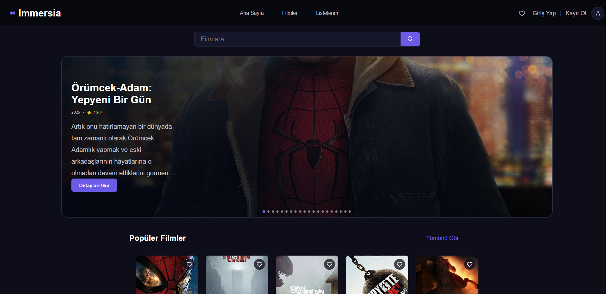
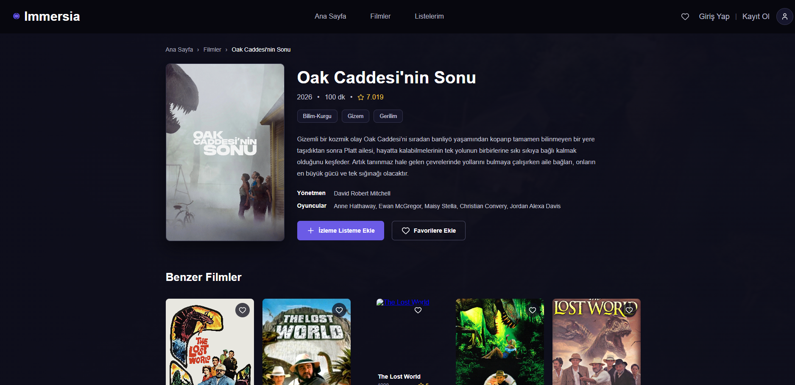
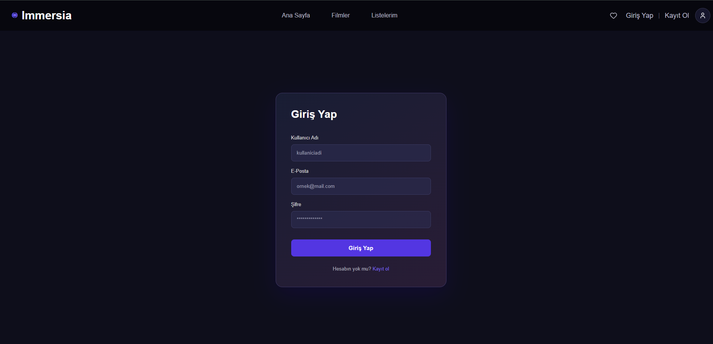
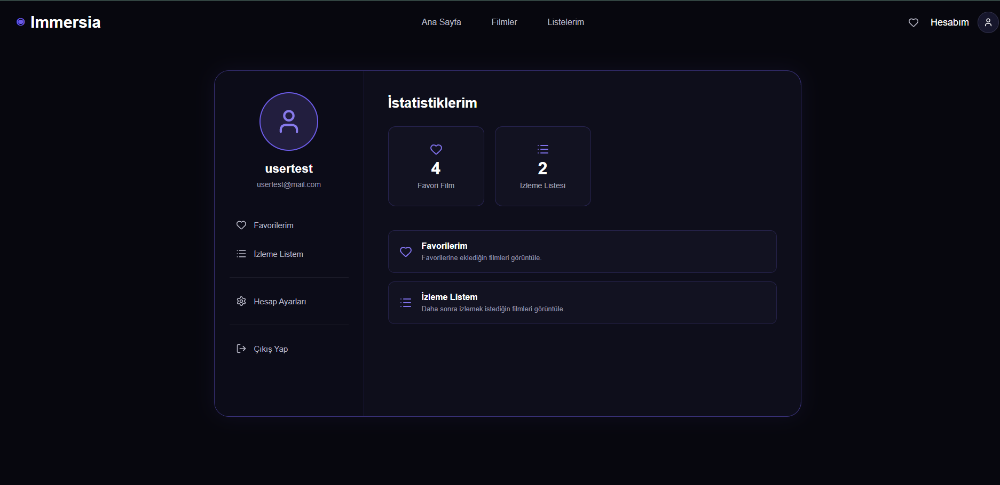

# Immersia

Immersia is a full-stack movie platform built with **React** and **Spring Boot**.  
The application retrieves movie data from **TMDB** through the backend and provides authentication, favorites, watchlist, movie search, movie details, and similar movie recommendations.

---

## Table of Contents

- [Features](#features)
- [Tech Stack](#tech-stack)
- [Quick Start](#quick-start)
  - [Prerequisites](#prerequisites)
  - [Backend Setup](#backend-setup)
  - [Frontend Setup](#frontend-setup)
- [Repository Structure](#repository-structure)
- [Architecture Overview](#architecture-overview)
- [Authentication](#authentication)
- [TMDB Integration](#tmdb-integration)
- [API Endpoints](#api-endpoints)
  - [Authentication Routes](#authentication-routes)
  - [Movie Routes](#movie-routes)
  - [Favorites Routes](#favorites-routes)
  - [Watchlist Routes](#watchlist-routes)
- [Environment Variables](#environment-variables)
- [Database](#database)
- [Testing](#testing)
- [Screenshots](#screenshots)
- [Future Improvements](#future-improvements)
- [Developer Checklist](#developer-checklist)
- [Common Pitfalls](#common-pitfalls)
- [License](#license)

---

## Features

- User registration and login
- JWT-based authentication
- Protected backend endpoints
- Movie discovery powered by TMDB
- Paginated movie listing
- Movie search
- Movie details
- Similar movie recommendations
- Add and remove favorite movies
- Add and remove movies from a watchlist
- User account page
- Responsive React interface
- REST API architecture
- PostgreSQL database
- Backend and frontend separated into independent applications

---

## Tech Stack

### Frontend

- React
- Vite
- JavaScript
- React Router
- Lucide React

### Backend

- Java
- Spring Boot
- Spring Web
- Spring Data JPA
- Spring Security
- JWT
- Hibernate

### Database

- PostgreSQL

### External API

- TMDB API

### Testing

- JUnit
- Mockito
- Spring Boot Test

---

## Quick Start

Immersia consists of two applications:

- `frontend` — React/Vite application
- `backend` — Spring Boot REST API

Run the backend and frontend separately during development.

### Prerequisites

Make sure the following are installed:

- Java 17 or later
- Maven
- Node.js
- npm
- PostgreSQL
- A TMDB API key

---

### Backend Setup

Go to the backend directory:

```bash
cd backend
```

Configure the required environment variables:

```text
DB_PASSWORD=your_database_password
TMDB_API_KEY=your_tmdb_api_key
JWT_SECRET=your_jwt_secret
```

The backend expects PostgreSQL to be available with the database:

```text
immersia_db
```

Start the Spring Boot application:

```bash
./mvnw spring-boot:run
```

On Windows PowerShell, you can also use:

```powershell
.\mvnw.cmd spring-boot:run
```

---

### Frontend Setup

Open another terminal and go to the frontend directory:

```bash
cd frontend
```

Install dependencies:

```bash
npm install
```

Start the development server:

```bash
npm run dev
```

The Vite development server normally runs on:

```text
http://localhost:5173
```

If that port is already in use, Vite may select another available port.

---

## Repository Structure

```text
Immersia/
├── frontend/
│   ├── public/
│   ├── src/
│   │   ├── components/
│   │   ├── pages/
│   │   ├── data/
│   │   ├── App.jsx
│   │   └── main.jsx
│   ├── package.json
│   └── vite.config.js
│
├── backend/
│   ├── src/
│   │   ├── main/
│   │   │   └── java/
│   │   │       └── ...
│   │   └── test/
│   ├── pom.xml
│   └── ...
│
└── README.md
```

### Frontend

The frontend contains the user interface, routing, movie pages, authentication pages, account pages, and reusable React components.

### Backend

The backend provides REST endpoints, authentication, database access, JWT security, and communication with TMDB.

---

## Architecture Overview

Immersia follows a separated frontend/backend architecture.

```text
                    ┌─────────────────────┐
                    │       React         │
                    │      Frontend       │
                    └──────────┬──────────┘
                               │
                         REST API Calls
                               │
                               ▼
                    ┌─────────────────────┐
                    │    Spring Boot      │
                    │      Backend        │
                    └──────┬───────┬──────┘
                           │       │
                 ┌─────────┘       └─────────┐
                 ▼                           ▼
        ┌─────────────────┐         ┌─────────────────┐
        │   PostgreSQL    │         │     TMDB API    │
        │    Database     │         │ Movie Data      │
        └─────────────────┘         └─────────────────┘
```

### Frontend

The React application handles:

- Page rendering
- Client-side routing
- Movie browsing
- Authentication UI
- Favorites
- Watchlist
- Account management

### Backend

The Spring Boot application handles:

- REST API endpoints
- User registration and login
- JWT authentication
- Protected resources
- PostgreSQL persistence
- TMDB communication
- Favorites and watchlist operations

### Database

PostgreSQL stores application-specific data such as users, favorites, and watchlist records.

---

## Authentication

Immersia uses **Spring Security** and **JWT** for authentication.

The authentication flow is:

```text
User
  │
  ├── Register/Login
  │
  ▼
Spring Boot
  │
  ├── Validate credentials
  ├── Hash/check password
  └── Generate JWT
  │
  ▼
Frontend
  │
  └── Stores JWT token
        │
        ▼
   Protected API Request
        │
        ▼
JWT Authentication Filter
        │
        ▼
Protected Controller
```

The backend uses a stateless security configuration. Protected requests require a valid Bearer token.

Example header:

```text
Authorization: Bearer <JWT_TOKEN>
```

---

## TMDB Integration

Immersia uses TMDB as the external movie data source.

The frontend does not need to communicate directly with TMDB. Instead, the Spring Boot backend communicates with TMDB and exposes application-specific endpoints to the frontend.

This keeps the TMDB API key on the backend side.

The backend uses TMDB for:

- Popular movie discovery
- Movie details
- Similar movies
- Movie search

---

## API Endpoints

### Authentication Routes

| Method | Endpoint | Description |
|---|---|---|
| POST | `/api/auth/register` | Register a new user |
| POST | `/api/auth/login` | Authenticate a user |
| GET | `/api/auth/me` | Get the current user |
| GET | `/api/auth/test` | Test JWT authentication |

### Movie Routes

| Method | Endpoint | Description |
|---|---|---|
| GET | `/api/movies` | Get paginated movies |
| GET | `/api/movies/{id}` | Get movie details |
| GET | `/api/movies/{id}/similar` | Get similar movies |
| GET | `/api/movies/search` | Search for movies |

### Favorites Routes

| Method | Endpoint | Description |
|---|---|---|
| GET | `/api/favorites` | Get the user's favorite movies |
| POST | `/api/favorites?movieId={movieId}` | Add a movie to favorites |
| DELETE | `/api/favorites/{id}` | Remove a movie from favorites |

### Watchlist Routes

| Method | Endpoint | Description |
|---|---|---|
| GET | `/api/watchlist` | Get the user's watchlist |
| POST | `/api/watchlist?movieId={movieId}` | Add a movie to the watchlist |
| DELETE | `/api/watchlist/{id}` | Remove a movie from the watchlist |

---

## Environment Variables

The backend uses environment variables for sensitive configuration.

| Variable | Description |
|---|---|
| `DB_PASSWORD` | PostgreSQL database password |
| `TMDB_API_KEY` | TMDB API key |
| `JWT_SECRET` | Secret used for JWT signing |

Example:

```text
DB_PASSWORD=your_database_password
TMDB_API_KEY=your_tmdb_api_key
JWT_SECRET=your_jwt_secret
```

Do not commit real secret values to GitHub.

Add environment files containing secrets to `.gitignore`.

---

## Database

Immersia uses PostgreSQL.

The backend connects to:

```text
jdbc:postgresql://localhost:5432/immersia_db
```

Application-specific data is persisted through Spring Data JPA and Hibernate.

The database is used for application data such as:

- Users
- Favorite movies
- Watchlist entries

Movie information itself is retrieved from TMDB.

---

## Testing

The backend contains tests using:

- JUnit
- Mockito
- Spring Boot Test

The test suite covers areas including authentication, JWT security, controllers, services, and protected endpoints.

Run backend tests with:

```bash
./mvnw test
```

On Windows PowerShell:

```powershell
.\mvnw.cmd test
```

---

## Screenshots## Screenshots

### Home



### Movie Details



### Login



### Account



Screenshots can be added here to document the main parts of the application.

Recommended structure:

```text
screenshots/
├── home.png
├── movie-detail.png
├── login.png
└── account.png
```

Example:

```markdown
## Screenshots

### Home


### Movie Details


### Login


### Account


```

---

## Future Improvements

Possible future improvements include:

- More advanced movie filtering
- Improved movie recommendation features
- Additional user profile features
- More comprehensive frontend testing
- Continuous Integration with GitHub Actions
- Production deployment
- Improved API documentation
- Better error handling and validation
- Additional movie categories and discovery options

---

## Developer Checklist

Before sharing or deploying the project, check the following:

### Authentication

- [ ] Registration works
- [ ] Login works
- [ ] JWT is generated correctly
- [ ] Protected endpoints reject unauthenticated requests
- [ ] Logout removes the stored token

### Movies

- [ ] Movie list loads correctly
- [ ] Movie details load correctly
- [ ] Movie search works
- [ ] Similar movies are displayed
- [ ] TMDB API key is stored securely

### Favorites and Watchlist

- [ ] Movies can be added to favorites
- [ ] Movies can be removed from favorites
- [ ] Movies can be added to the watchlist
- [ ] Movies can be removed from the watchlist

### Database

- [ ] PostgreSQL is running
- [ ] Database connection works
- [ ] User data is persisted correctly
- [ ] Favorite and watchlist data is persisted correctly

### Documentation

- [ ] Quick Start instructions are correct
- [ ] Environment variables are documented
- [ ] API endpoints are documented
- [ ] Screenshots are added
- [ ] No secret values are committed

---

## Common Pitfalls

### Hardcoding API Keys

Never place real API keys or JWT secrets directly in source code.

Use environment variables instead:

```text
TMDB_API_KEY=your_tmdb_api_key
JWT_SECRET=your_jwt_secret
```

### Forgetting the Database

The backend requires PostgreSQL to be running and configured with the expected database connection.

### Running Only the Frontend

Immersia uses a separate backend API. Start both applications during development:

```text
Backend  → Spring Boot
Frontend → Vite
```

### Invalid or Missing JWT

Protected endpoints require a valid Bearer token:

```text
Authorization: Bearer <JWT_TOKEN>
```

### Exposing Backend Secrets

Do not commit `.env` files or real secret values to the repository.

---

## License

This project is created for educational and portfolio purposes.

All rights reserved unless otherwise stated.
